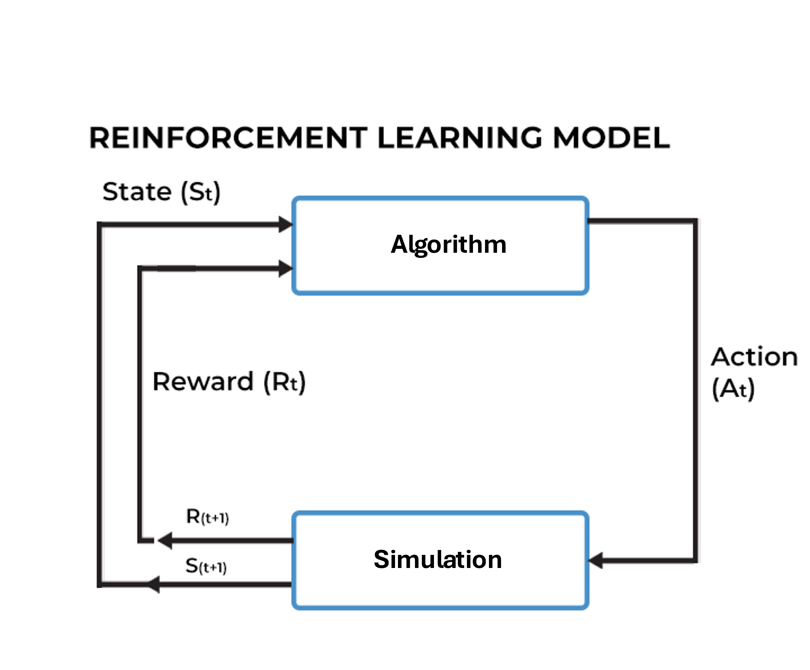
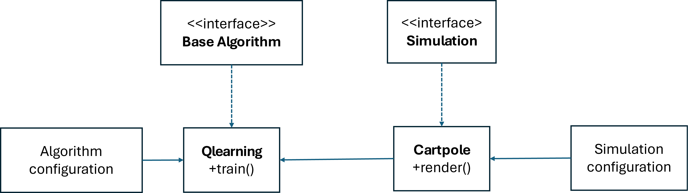
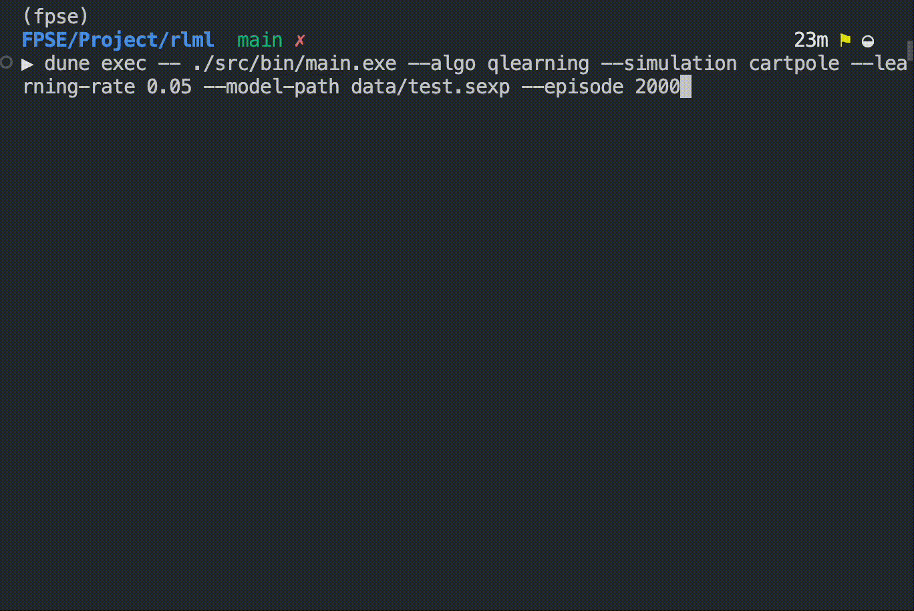
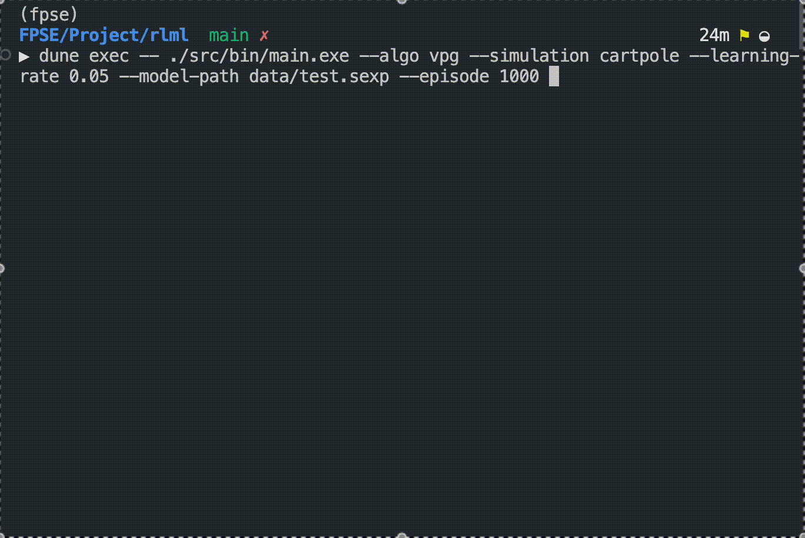

# RLlib

  

RLlib is a library that allows users to have a quick prototype of machine learning algorithms to solve games and other decision making problems. The library is implemented in OCaml, a functional programming language that is known for its strong type system and expressive syntax. The library is designed to be modular and extensible, allowing users to easily swap out different algorithms and simulation environments. The library currently supports three classic simulations: Cartpole, Pendulum, and Blackjack. The library also supports three reinforcement learning algorithms: Q-Learning, Policy Gradient, and Policy Gradient with Neural Network. The library is designed to be easy to use and understand, with a command-line interface that allows users to specify the algorithm, simulation environment, and training configurations.  

# Implementation
## Interaction protocol.
In our implementation, the reinforcement learning algorithms and simulations interact through a well-defined interface. This interface allows the algorithms to interact with the simulations in a consistent manner, regardless of the specific simulation environment. The interface consists of the following key components:
- **State**: Represents the current state of the simulation environment. It is a record type that encapsulates all relevant information about the environment at a given time step.
- **Action**: Represents the action taken by the reinforcement learning algorithm in response to the current state. It is a variant type that can be either discrete or continuous, depending on the simulation environment.
- **Reward**: Represents the reward received by the reinforcement learning algorithm for taking a specific action in a given state. It is a scalar value that quantifies the quality of the action taken.
- **Step**: Represents the transition from one state to another based on the action taken by the reinforcement learning algorithm. It is a function that updates the state of the simulation environment and returns the reward for the action taken.
- **Episode**: Represents a sequence of steps that occur from the initial state to a terminal state. It is a function that executes multiple steps until a terminal condition is met, such as reaching a maximum number of steps or a specific goal.


## Architecture
The figure below shows the architecture of our library. 




## Libraries

### Dependent Library

- `core`
- `core_unix`
- `bisect_ppx`
- `ounit2`
- `torch` 

### **Torch Library**

The `torch` library in OCaml provides bindings to the LibTorch C++ API, which is the core of PyTorch. It enables machine learning and deep learning capabilities directly in OCaml, including tensor operations, model training, and GPU acceleration (if supported by the underlying system). This library is particularly useful for integrating PyTorch's powerful features into OCaml-based workflows.

For more details, see [ocaml-torch](https://github.com/LaurentMazare/ocaml-torch).

# Simulations

## Overview
The purpose of our simulations is to provide environments, also called _situations_, where reinforcement learning (RL) algorithms can train and evaluate their performance. These simulations serve as controlled, reproducible benchmarks to test the capabilities of various RL methods.

These simulations take an action from the reinforcement learning algorithm, called the _actor_, update its state, while also returning a reward for the actor's actions as it relates to the state.

>Our simulations do not store their own state, as that is not good functional programming. Rather they take in a record as a parameter that represents the state, and returns a similar record


We currently have implemented three classic simulations for actors to train on: Cartpole, Pendulum, and Blackjack. Descriptions of each are below.

---
## Key Features

#### Simplicity and Reproducibility
- The environments are intentionally simple to ensure that results can be easily interpreted and replicated across different experiments. This simplicity allows users to focus on algorithmic performance without distractions caused by overly complex environments
	
#### Command-Line Rendering
- Simulations can be rendered through the command line. We chose this approach because:
	- **Minimalism**: High-fidelity graphics are unnecessary for understanding the agents' interactions in these environments
	- **Lightweight**: By avoiding graphical libraries, we minimize external dependencies, making the library easier to install and more portable
	
#### Modular Design
- The simulations are designed with modularity in mind. Users can:
	- Swap out environments with minimal code changes
	- Extend or create new simulations tailored to their specific needs
	
---
### Cartpole

- **Description**:  
     In this classic control problem, the agent's task is to balance a pole attached to a moving cart. The pole starts in an random position, and the agent must apply forces to the cart to prevent the pole from falling over
- **Objective**:  
     Keep the pole balanced for as many time steps as possible without letting it fall or moving the cart out of bounds
- **Action Space**:
     **Discrete**: Move the cart left or right
- **Observation Space**:
	- Cart position
	- Cart velocity
	- Pole angle
	- Pole angular velocity


### Pendulum

- **Description**:  
     The pendulum starts in a random position, and the agent must apply torque to swing it into an upright position and keep it balanced. The action space and dynamics are continuous, requiring fine-grained control.
- **Objective**:  
     Minimize the energy required to swing up and balance the pendulum upright while keeping it stable.
- **Action Space**:
     **Continuous**: A single float representing torque applied to the pendulum.
- **Observation Space**:
    - Pendulum's Angular position (cosine and sine representation for periodicity).
    - Pendulum's angular velocity


### Blackjack

- **Description**:  
     A simulation of the popular card game where the agent learns to make decisions (hit or stand) based on the state of the game.
- **Objective**:  
     Maximize wins by learning an optimal strategy for playing hands against a dealer.
- **Action Space**:
    - **Discrete**:
        - Hit (draw another card).
        - Stand (keep the current hand and end the turn)
- **Observation Space**:
    - Current hand value
    - Dealer’s visible card
    - Presence of a usable ace (value of 1 or 11)

# Algorithms
## Q-Learning
Q-Learning is a model-free reinforcement learning algorithm that learns the value of an action in a particular state. The algorithm uses a Q-table to store the value of each action in each state. During training, the agent explores the environment by taking actions and updating the Q-table based on the rewards received. The Q-table is updated using the Bellman equation, which estimates the value of an action based on the immediate reward and the estimated value of the next state. Over time, the agent learns the optimal policy by selecting the action with the highest Q-value in each state.

The update rule:
$$Q(s, a) = Q(s, a) + \alpha \cdot (r + \gamma \cdot \max_{a'} Q(s', a') - Q(s, a))$$

For more details, see [Q-Learning](https://en.wikipedia.org/wiki/Q-learning).


## Policy Gradient
## Policy Gradient with Neural Network


# How to run

## Environment

**Note**: Only the Torch installation part is macOS-specific; all other steps are platform-independent. For other platforms, the Torch installation needs to be adjusted accordingly.

### Prerequisites

Before proceeding, ensure you have the following installed on your system:

- Opam (version 2.1 or higher)
- Python (version: `3.10–3.12` recommended, with `torch==2.3`)

### OCaml Environment

Create opam environment with Ocaml version - 5.1.1.

```bash
opam switch create RLlib ocaml-base-compiler.5.1.1
opam switch RLlib
eval $(opam env)
```

### Install Dependencies

Install dependent libraries with the following commands.

```
opam install core core_unix bisect_ppx ounit2
LIBTORCH=<path/to/you/python/site-package>/torch/ opam pin torch https://github.com/arbipher/torch.git#fix-macos
```

The following command can help to obtain `<path/to/you/python/site-package>/torch/`

```bash
python -c "import torch; print(torch.__path__[0])"
```

P.S. `Torch` installation refers to: [OCaml-torch user thread](https://courselore.org/courses/9034692226/conversations/164)

## Build and Run

make sure you have created a data folder at the root dictory by:
```
mkdir data
```
To build the project from the root directory:
```
dune clean; dune build
```
Explaination for basic parameters:
- algo: Specify the algorithm (e.g., qlearning, vpg, vpgnn).
- simulation: Specify the simulation environment (e.g., pendulum, cartpole, blackjack).
- episode: The number of training episodes to run.
- model-path: The file path for saving/loading the model
- render: Whether to render the simulation during training.

To train a Model, For example, to train a q-learning algorithm with the pendulum simulation for 300000 episodes, you can run the following command:  
```
dune exec -- ./src/bin/main.exe --episode 300000 --model-path data/pendulum.sexp
```
It would take a minute or two to complete 300000 episodes, we can obtain a relative good policy. to view the results of the trained q-learning algorithm with the pendulum simulation, you can add the `--render` argument:  
```
dune exec -- ./src/bin/main.exe --episode 300000 --model-path data/pendulum.sexp --render
```

## Demonstration

### Training

<div style="display: flex; justify-content: center; gap: 10px; white-space: nowrap; align-items: center;">
  <div style="text-align: center; width: 30%;">
    
    <div style="font-size: 12px;">Training QLearning</div>
  </div>
  <div style="text-align: center; width: 30%; ">
    
    <div style="font-size: 12px;">Training VPG</div>
  </div>
  <div style="text-align: center; width: 30%;">
    
    <div style="font-size: 12px;">Training VPGNN</div>
  </div>
</div>


<table style="border-collapse: collapse; width: 100%; text-align: center;">
  <tr style="border: none;">
    <td style="border: none;">
      
      <br />
      Training QLearning
    </td>
    <td style="border: none;">
      
      <br />
      Training VPG
    </td>
    <td style="border: none;">
      
      <br />
      Training VPGNN
    </td>
  </tr>
</table>


### Simulation

[cartpole-qlearning.gif] [cartpole-vpg.gif] [cartpole-vpgnn.gif]

[pendulum-qlearning.gif] [pendulum-vpg.gif] [pendulum-vpgnn.gif]

[blackjack-qlearning.gif] [blackjack-vpg.gif]

# Conclusion and Future Work
Our project demonstrates the implementation of key RL algorithms—Q-Learning, Vanilla Policy Gradient, and Policy Gradient with Neural Networks—within OCaml codebase. By integrating these algorithms with diverse simulation environments, we have shown that our approach is both versatile and extensible. The use of functors and well-defined interfaces makes it straightforward to incorporate new algorithms or simulation engines. Our toolkit serves as a practical platform for experimenting with RL ideas.

For future work:
- Additional Algorithms: Expand the algorithm library to include Actor-Critic methods, PPO, DQN variations, or advanced algorithms like Soft Actor-Critic.
- More Environments: Integrating more simulations (e.g., Lunar Lander, Atari games, or custom robotics domains).
- Enhanced Visualization and Monitoring: Improve the graphical interfaces or adding web-based dashboards for monitoring training progress and analyzing policies.
- Performance Optimization: Explore optimization techniques, parallelization to handle more complex tasks and speed up training.

# Group Members
 Jishuo Yang, Yang Shen, Spencer Ye, Anh Do 
