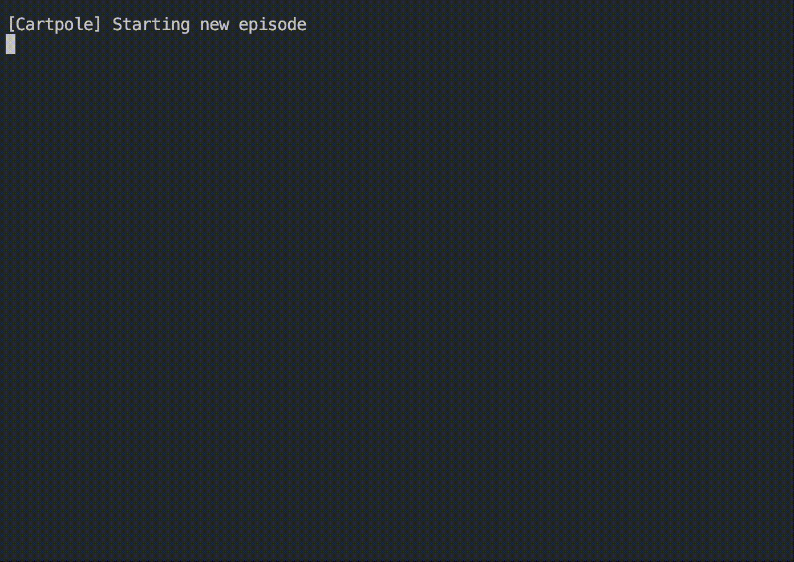
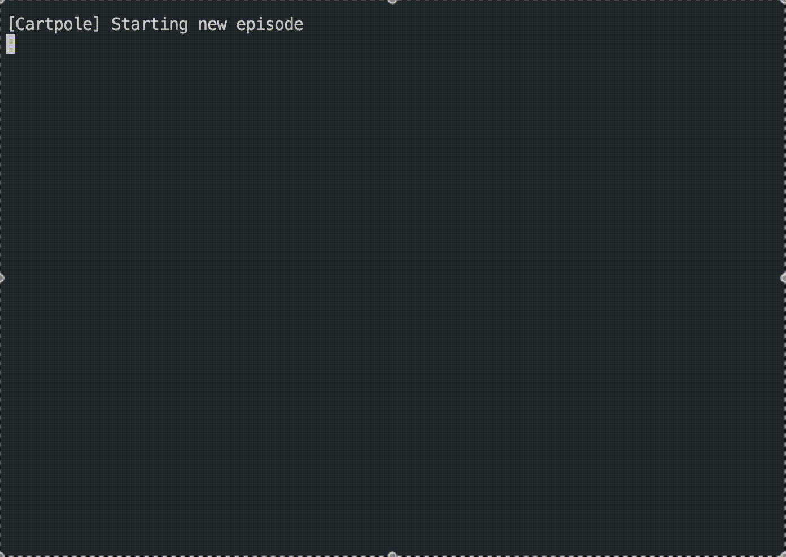
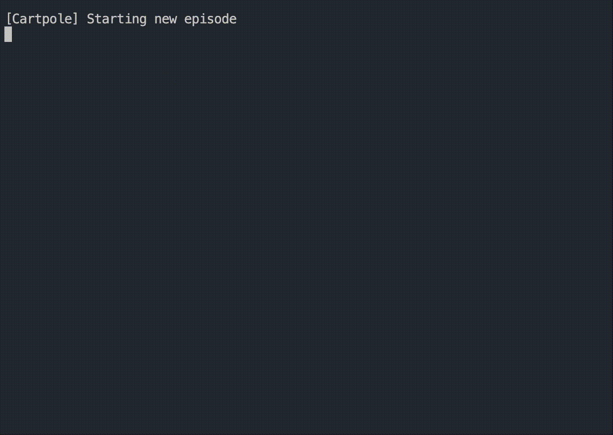
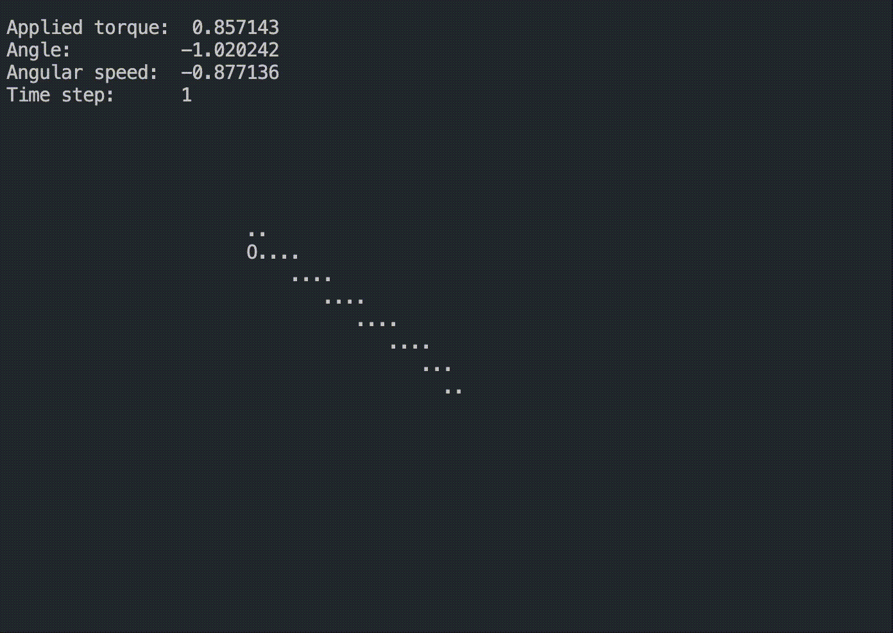
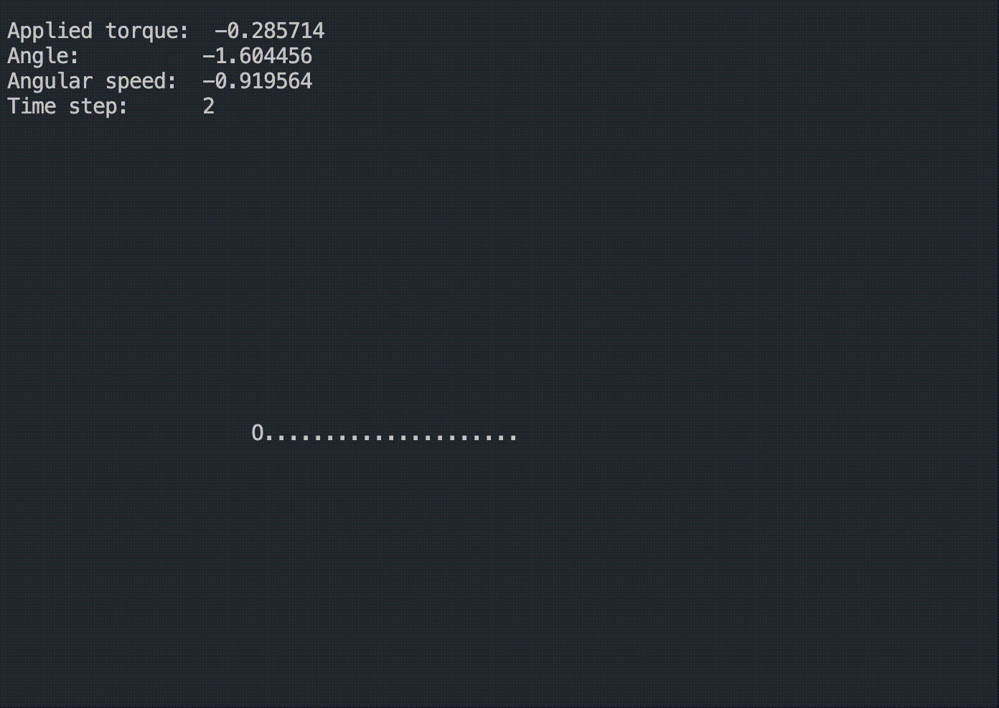
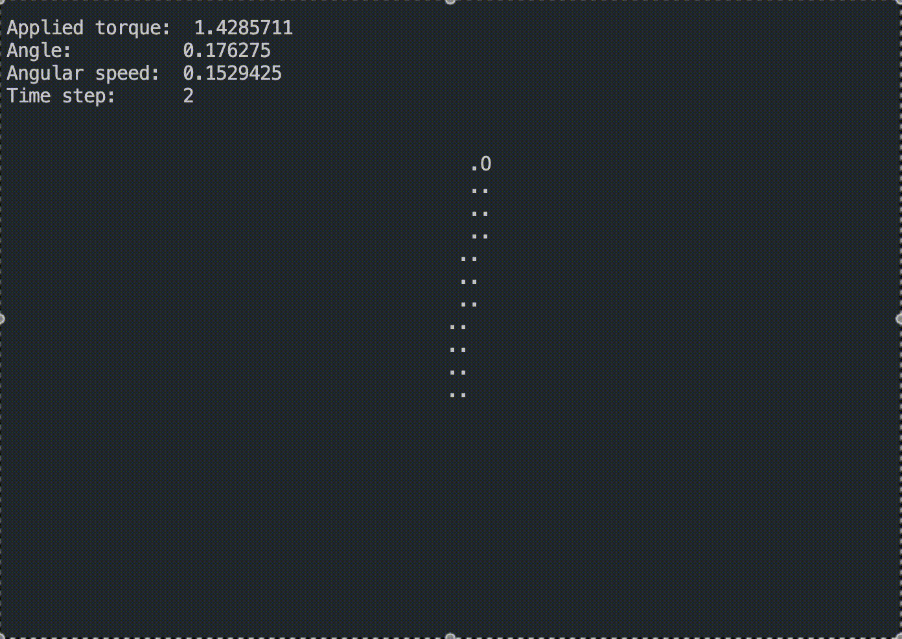
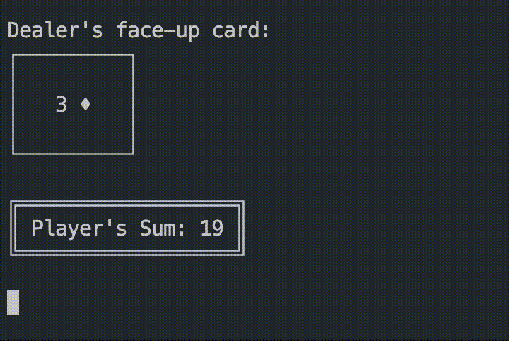
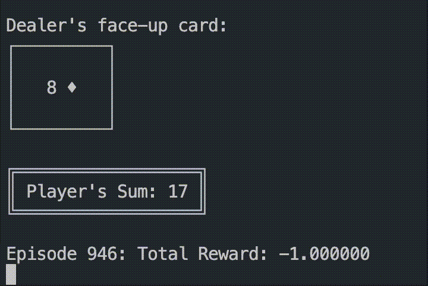
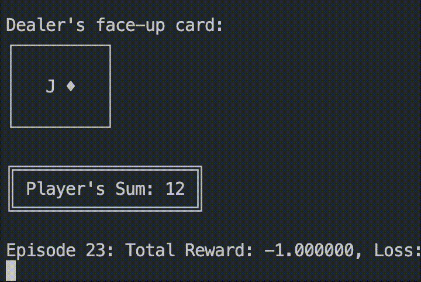

# ascii-rl-lib

  

RLlib is a library that allows users to have a quick prototype of machine learning algorithms to solve games/control tasks. The library is implemented in OCaml, a functional programming language that is known for its strong type system and expressive syntax. The library is designed to be modular and extensible, allowing users to easily swap out different algorithms and simulation environments. The library currently supports three classic simulations: Cartpole, Pendulum, and Blackjack. The library also supports three reinforcement learning algorithms: Q-Learning, Policy Gradient, and Policy Gradient with Neural Network. 

## Demonstration

### Training

<p align="center">
  
  
  
</p>

<p align="center">
  Training QLearning &nbsp;&nbsp;&nbsp;&nbsp;&nbsp;&nbsp;&nbsp;&nbsp;&nbsp;&nbsp;&nbsp;&nbsp;&nbsp;&nbsp;&nbsp;&nbsp;&nbsp;&nbsp;&nbsp;&nbsp;&nbsp;&nbsp;&nbsp;&nbsp;&nbsp;&nbsp;&nbsp;&nbsp;&nbsp;&nbsp;&nbsp;&nbsp;&nbsp;&nbsp;&nbsp;&nbsp;&nbsp; Training VPG &nbsp;&nbsp;&nbsp;&nbsp;&nbsp;&nbsp;&nbsp;&nbsp;&nbsp;&nbsp;&nbsp;&nbsp;&nbsp;&nbsp;&nbsp;&nbsp;&nbsp;&nbsp;&nbsp;&nbsp;&nbsp;&nbsp;&nbsp;&nbsp;&nbsp;&nbsp;&nbsp;&nbsp;&nbsp;&nbsp;&nbsp;&nbsp;&nbsp;&nbsp;&nbsp;&nbsp;&nbsp; Training VPGNN
</p>

### Simulation


<p align="center">
  
  
  
</p>


<p align="center">
  Cartpole-QLearning &nbsp;&nbsp;&nbsp;&nbsp;&nbsp;&nbsp;&nbsp;&nbsp;&nbsp;&nbsp;&nbsp;&nbsp;&nbsp;&nbsp;&nbsp;&nbsp;&nbsp;&nbsp;&nbsp;&nbsp;&nbsp;&nbsp;&nbsp;&nbsp;&nbsp;&nbsp;&nbsp;&nbsp;&nbsp;&nbsp;&nbsp;&nbsp;&nbsp;&nbsp;&nbsp;&nbsp;&nbsp; Cartpole-VPG &nbsp;&nbsp;&nbsp;&nbsp;&nbsp;&nbsp;&nbsp;&nbsp;&nbsp;&nbsp;&nbsp;&nbsp;&nbsp;&nbsp;&nbsp;&nbsp;&nbsp;&nbsp;&nbsp;&nbsp;&nbsp;&nbsp;&nbsp;&nbsp;&nbsp;&nbsp;&nbsp;&nbsp;&nbsp;&nbsp;&nbsp;&nbsp;&nbsp;&nbsp;&nbsp;&nbsp;&nbsp; Cartpole-VPGNN
</p>

<p align="center">
  
  
  
</p>

<p align="center">
  Pendulum-QLearning &nbsp;&nbsp;&nbsp;&nbsp;&nbsp;&nbsp;&nbsp;&nbsp;&nbsp;&nbsp;&nbsp;&nbsp;&nbsp;&nbsp;&nbsp;&nbsp;&nbsp;&nbsp;&nbsp;&nbsp;&nbsp;&nbsp;&nbsp;&nbsp;&nbsp;&nbsp;&nbsp;&nbsp;&nbsp;&nbsp;&nbsp;&nbsp;&nbsp;&nbsp;&nbsp;&nbsp;&nbsp; Pendulum-VPG &nbsp;&nbsp;&nbsp;&nbsp;&nbsp;&nbsp;&nbsp;&nbsp;&nbsp;&nbsp;&nbsp;&nbsp;&nbsp;&nbsp;&nbsp;&nbsp;&nbsp;&nbsp;&nbsp;&nbsp;&nbsp;&nbsp;&nbsp;&nbsp;&nbsp;&nbsp;&nbsp;&nbsp;&nbsp;&nbsp;&nbsp;&nbsp;&nbsp;&nbsp;&nbsp;&nbsp;&nbsp; Pendulum-VPGNN
</p>


<p align="center">
  
  
  
</p>

<p align="center">
  Blackjack-QLearning &nbsp;&nbsp;&nbsp;&nbsp;&nbsp;&nbsp;&nbsp;&nbsp;&nbsp;&nbsp;&nbsp;&nbsp;&nbsp;&nbsp;&nbsp;&nbsp;&nbsp;&nbsp;&nbsp;&nbsp;&nbsp;&nbsp;&nbsp;&nbsp;&nbsp;&nbsp;&nbsp;&nbsp;&nbsp;&nbsp;&nbsp;&nbsp;&nbsp;&nbsp;&nbsp;&nbsp;&nbsp; Blackjack-VPG &nbsp;&nbsp;&nbsp;&nbsp;&nbsp;&nbsp;&nbsp;&nbsp;&nbsp;&nbsp;&nbsp;&nbsp;&nbsp;&nbsp;&nbsp;&nbsp;&nbsp;&nbsp;&nbsp;&nbsp;&nbsp;&nbsp;&nbsp;&nbsp;&nbsp;&nbsp;&nbsp;&nbsp;&nbsp;&nbsp;&nbsp;&nbsp;&nbsp;&nbsp;&nbsp;&nbsp;&nbsp; Blackjack-VPGNN
</p>


# Implementation
## Interaction protocol.
In our implementation, the reinforcement learning algorithms and simulations interact through a well-defined interface. This interface allows the algorithms to interact with the simulations in a consistent manner, regardless of the specific simulation environment. The interface consists of the following key components:
- **State**: Represents the current state of the simulation environment. It is a record type that encapsulates all relevant information about the environment at a given time step.
- **Action**: Represents the action taken by the reinforcement learning algorithm in response to the current state. It is a variant type that can be either discrete or continuous, depending on the simulation environment.
- **Reward**: Represents the reward received by the reinforcement learning algorithm for taking a specific action in a given state. It is a scalar value that quantifies the quality of the action taken.
- **Step**: Represents the transition from one state to another based on the action taken by the reinforcement learning algorithm. It is a function that updates the state of the simulation environment and returns the reward for the action taken.
- **Episode**: Represents a sequence of steps that occur from the initial state to a terminal state. It is a function that executes multiple steps until a terminal condition is met, such as reaching a maximum number of steps or a specific goal.


## Architecture
The figure below shows the architecture of our library. 


## Libraries

### Dependent Library

- `core`
- `core_unix`
- `bisect_ppx`
- `ounit2`
- `torch` 

### **Torch Library**

The `torch` library in OCaml provides bindings to the LibTorch C++ API, which is the core of PyTorch. It enables machine learning and deep learning capabilities directly in OCaml, including tensor operations, model training, and GPU acceleration (if supported by the underlying system). This library is particularly useful for integrating PyTorch's powerful features into OCaml-based workflows.

For more details, see [ocaml-torch](https://github.com/LaurentMazare/ocaml-torch).

# Simulations

## Overview
The purpose of our simulations is to provide environments, also called _situations_, where reinforcement learning (RL) algorithms can train and evaluate their performance. These simulations serve as controlled, reproducible benchmarks to test the capabilities of various RL methods.

These simulations take an action from the reinforcement learning algorithm, called the _actor_, update its state, while also returning a reward for the actor's actions as it relates to the state.

>Our simulations do not store their own state, as that is not good functional programming. Rather they take in a record as a parameter that represents the state, and returns a similar record


We currently have implemented three classic simulations for actors to train on: Cartpole, Pendulum, and Blackjack. Descriptions of each are below.

---
## Key Features

#### Simplicity and Reproducibility
- The environments are intentionally simple to ensure that results can be easily interpreted and replicated across different experiments. This simplicity allows users to focus on algorithmic performance without distractions caused by overly complex environments
	
#### Command-Line Rendering
- Simulations can be rendered through the command line. We chose this approach because:
	- **Minimalism**: High-fidelity graphics are unnecessary for understanding the agents' interactions in these environments
	- **Lightweight**: By avoiding graphical libraries, we minimize external dependencies, making the library easier to install and more portable
	
#### Modular Design
- The simulations are designed with modularity in mind. Users can:
	- Swap out environments with minimal code changes
	- Extend or create new simulations tailored to their specific needs
	
---
### Cartpole

- **Description**:  
     In this classic control problem, the agent's task is to balance a pole attached to a moving cart. The pole starts in an random position, and the agent must apply forces to the cart to prevent the pole from falling over
- **Objective**:  
     Keep the pole balanced for as many time steps as possible without letting it fall or moving the cart out of bounds
- **Action Space**:
     **Discrete**: Move the cart left or right
- **Observation Space**:
	- Cart position
	- Cart velocity
	- Pole angle
	- Pole angular velocity


### Pendulum

- **Description**:  
     The pendulum starts in a random position, and the agent must apply torque to swing it into an upright position and keep it balanced. The action space and dynamics are continuous, requiring fine-grained control.
- **Objective**:  
     Minimize the energy required to swing up and balance the pendulum upright while keeping it stable.
- **Action Space**:
     **Continuous**: A single float representing torque applied to the pendulum.
- **Observation Space**:
    - Pendulum's Angular position (cosine and sine representation for periodicity).
    - Pendulum's angular velocity


### Blackjack

- **Description**:  
     A simulation of the popular card game where the agent learns to make decisions (hit or stand) based on the state of the game.
- **Objective**:  
     Maximize wins by learning an optimal strategy for playing hands against a dealer.
- **Action Space**:
    - **Discrete**:
        - Hit (draw another card).
        - Stand (keep the current hand and end the turn)
- **Observation Space**:
    - Current hand value
    - Dealer’s visible card
    - Presence of a usable ace (value of 1 or 11)

# Algorithms
## Q-Learning
Q-Learning is a model-free reinforcement learning algorithm that learns the value of an action in a particular state. The algorithm uses a Q-table to store the value of each action in each state. During training, the agent explores the environment by taking actions and updating the Q-table based on the rewards received. The Q-table is updated using the Bellman equation, which estimates the value of an action based on the immediate reward and the estimated value of the next state. Over time, the agent learns the optimal policy by selecting the action with the highest Q-value in each state.

The update rule:
$$Q(s, a) = Q(s, a) + \alpha \cdot (r + \gamma \cdot \max_{a'} Q(s', a') - Q(s, a))$$

For more details, see [Q-Learning](https://en.wikipedia.org/wiki/Q-learning).


## Policy Gradient

Policy Gradient is a reinforcement learning algorithm that directly optimizes the policy function:

$$ \pi_\theta(a \mid s) $$

This function represents the probability of taking action `a` in state `s`. The objective is to maximize the expected cumulative reward by adjusting the policy parameters $\theta$. In this project, Vanilla Policy Gradient (VPG) is implemented, which is one form of Policy Gradient and update policy with Reward. The gradient of the objective is computed using the following formula:

$$
\nabla_\theta J(\theta) = \mathbb{E}\big[ \nabla_\theta \log \pi_\theta(a_t \mid s_t) \cdot R_t \big]
$$

Where:
- $\pi_\theta(a_t \mid s_t)$: The policy function, representing the probability of taking action $a_t$ in state $s_t$.
- $R_t$: The cumulative reward, calculated as:

$$
R_t = \sum_{k=0}^\infty \gamma^k r_{t+k}
$$

Here:
- $\gamma$: The discount factor, which determines the importance of future rewards.
- $r_{t+k}$: The reward received at step $t+k$.

For more details, see [Policy Gradient](https://spinningup.openai.com/en/latest/algorithms/vpg.html).


## Policy Gradient with Neural Network

In contrast to the standard Policy Gradient, which represents the policy $\pi_\theta(a \mid s)$ with parameterized weights or a table, Policy Gradient with Neural Network (PGNN) uses a neural network to parameterize the policy. This allows the algorithm to handle large or continuous state-action spaces effectively.

Instead of directly associating parameters with actions, the neural network takes the state $s$ as input and outputs a probability distribution over actions. The neural network outputs logits, which are transformed into probabilities using the softmax function. Actions are then sampled from this distribution.

The policy is updated by backpropagating the gradient of the cumulative reward-weighted log-probabilities through the network. This is achieved by optimizing the following objective:

$$
\mathcal{L}(\theta) = -\mathbb{E}\big[ \log \pi_\theta(a_t \mid s_t) \cdot R_t \big]
$$

### Key Benefits
- **Scalability**: Neural networks allow the policy to generalize across large or continuous state spaces.
- **Representation Power**: Neural networks can capture complex, non-linear relationships between states and actions.
- **Efficiency**: Parameter sharing in the network significantly reduces memory requirements compared to table-based representations.


# How to run

## Environment

**Note**: Only the Torch installation part is macOS-specific; all other steps are platform-independent. For other platforms, the Torch installation needs to be adjusted accordingly.

### Prerequisites

Before proceeding, ensure you have the following installed on your system:

- Opam (version 2.1 or higher)
- Python (version: `3.10–3.12` recommended, with `torch==2.3`)

### OCaml Environment

Create opam environment with Ocaml version - 5.1.1.

```bash
opam switch create RLlib ocaml-base-compiler.5.1.1
opam switch RLlib
eval $(opam env)
```

### Install Dependencies

Install dependent libraries with the following commands.

```
opam install core core_unix bisect_ppx ounit2
LIBTORCH=<path/to/you/python/site-package>/torch/ opam pin torch https://github.com/arbipher/torch.git#fix-macos
```

The following command can help to obtain `<path/to/you/python/site-package>/torch/`

```bash
python -c "import torch; print(torch.__path__[0])"
```

P.S. `Torch` installation refers to: [OCaml-torch user thread](https://courselore.org/courses/9034692226/conversations/164)

## Build and Run

To build the project from the root directory:
```
dune clean; dune build
```
Explaination for basic parameters:
- algo: Specify the algorithm (e.g., qlearning, vpg, vpgnn).
- simulation: Specify the simulation environment (e.g., pendulum, cartpole, blackjack).
- episode: The number of training episodes to run.
- learning_rate: learning rate for the algorithm.
- gamma: discount factor.
- model-path: The file path for saving/loading the model.
- render: Whether to render the simulation during training.

To train a Model, For example, to train a q-learning algorithm with the pendulum simulation for 300000 episodes, you can run the following command:  
```
dune exec -- ./src/bin/main.exe --episode 300000 --model-path model/pendulum_qlearning.sexp --learning-rate 0.1 --gamma 0.99 --algo qlearning --simulation pendulum 
```
It would take a minute or two to complete 300000 episodes, we can obtain a relative good policy. to view the results of the trained q-learning algorithm with the pendulum simulation, you can add the `--render` argument:  
```
dune exec -- ./src/bin/main.exe --episode 300000 --model-path model/pendulum_qlearning.sexp --learning-rate 0.1 --gamma 0.99 --algo qlearning --simulation pendulum --render
```
